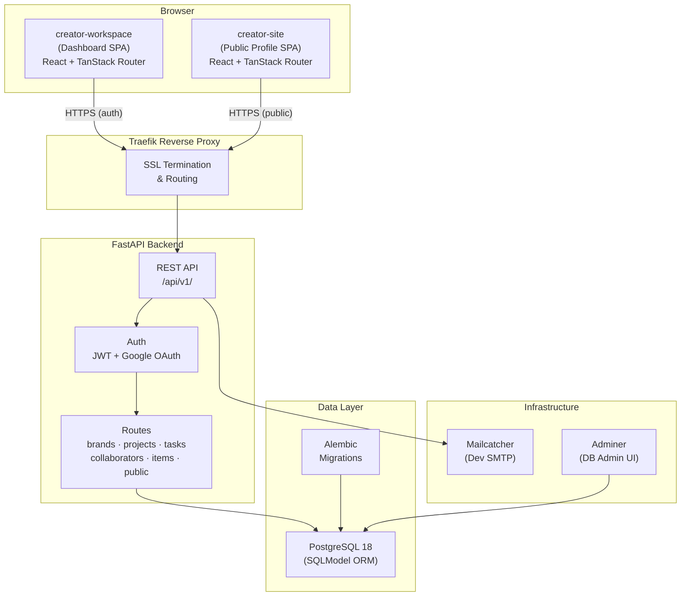
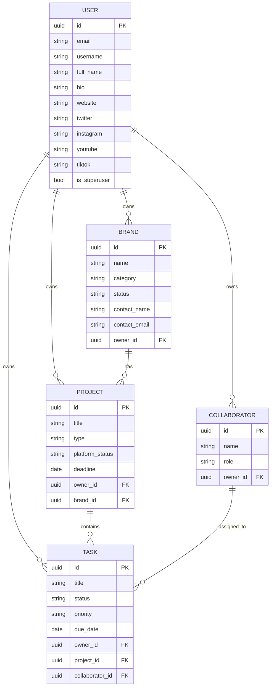
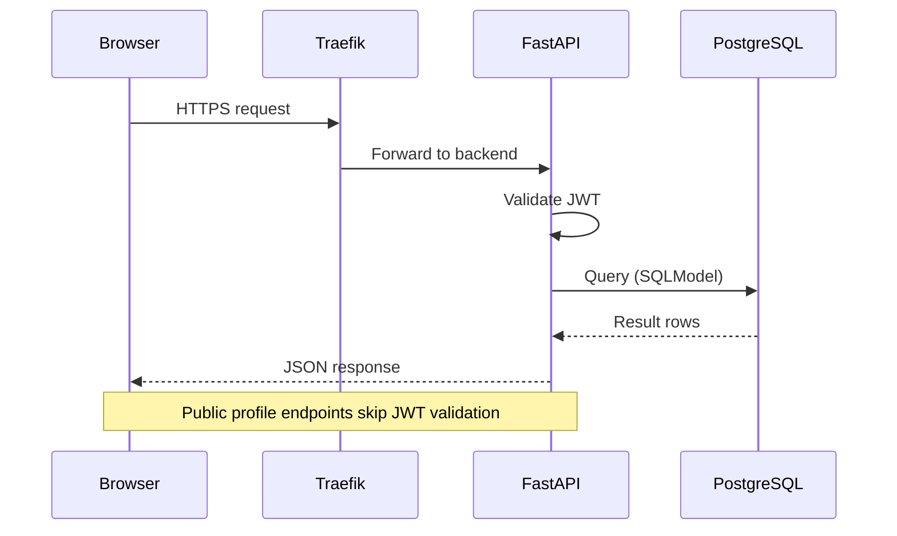

# CreatorHandle

A full-stack creator management platform. Creators get a **private workspace dashboard** to manage their brands, projects, tasks, and team — plus a **public profile page** that showcases their work to the world.

---

## Overview

CreatorHandle gives content creators and agencies a single hub to:

- Organize brands, projects, and tasks in one place
- Track project progress and deadlines
- Assign tasks to named collaborators (team members)
- Share a polished public profile page with potential clients

The platform is split into two frontends backed by a single FastAPI/PostgreSQL API:

| App | Purpose |
|---|---|
| **creator-workspace** | Private dashboard — auth-protected, full CRUD for all entities |
| **creator-site** | Public profile — no auth, displays creator's portfolio to visitors |

---

## Architecture

### Data Model

### Request Flow

---

## Tech Stack

### Backend

| Layer | Technology |
|---|---|
| Framework | [FastAPI](https://fastapi.tiangolo.com/) 0.114+ |
| Language | Python 3.12+ |
| ORM | [SQLModel](https://sqlmodel.tiangolo.com/) + SQLAlchemy |
| Database | PostgreSQL 18 |
| Migrations | Alembic |
| Auth | PyJWT · pwdlib (bcrypt/argon2) · Google OAuth 2.0 |
| Validation | Pydantic v2 |
| Email | Jinja2 templates + SMTP |
| Package manager | [uv](https://docs.astral.sh/uv/) |

### Frontend (both apps)

| Layer | Technology |
|---|---|
| Framework | React 19 + TypeScript |
| Router | [TanStack Router](https://tanstack.com/router) v1 (file-based) |
| Server state | [TanStack Query](https://tanstack.com/query) v5 |
| Forms | React Hook Form 7 + Zod |
| UI components | [shadcn/ui](https://ui.shadcn.com/) + Radix UI primitives |
| Styling | Tailwind CSS v4 |
| HTTP client | Axios (auto-generated OpenAPI client) |
| Build tool | Vite 7 + SWC |
| Package manager | [Bun](https://bun.sh/) |
| Linting | Biome |

### Infrastructure

| Service | Technology |
|---|---|
| Containerization | Docker + Docker Compose |
| Reverse proxy | [Traefik](https://traefik.io/) (SSL, routing) |
| DB admin | Adminer |
| Dev email | Mailcatcher |
| Error tracking | Sentry SDK |

---

## Documentation

- [Local Development Guide](docs/development.md)
- [Deployment Guide](docs/deployment.md)
- [Backend Guide](backend/README.md)
- [Frontend Guide](frontend/README.md)
- [Security Policy](docs/SECURITY.md)

---

## License

MIT
